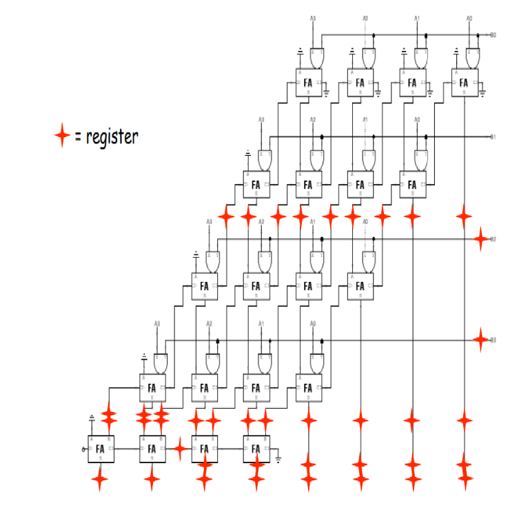
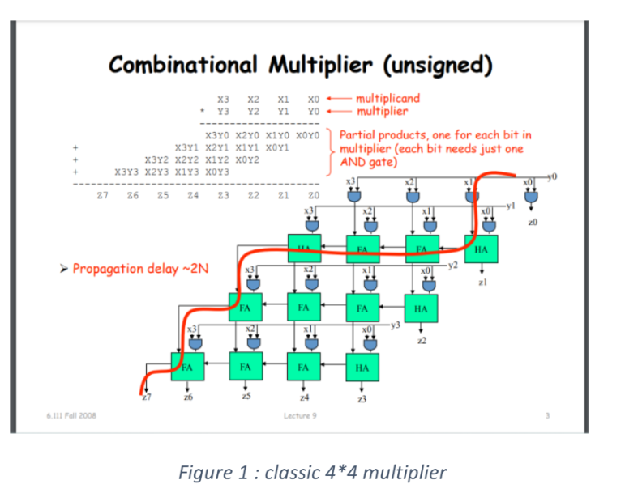
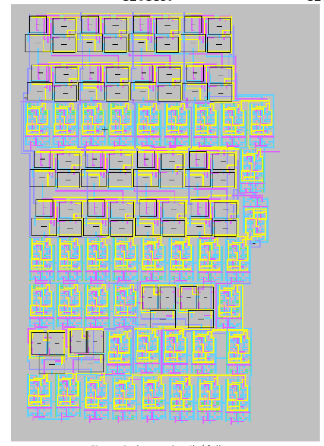

# Power-Optimized 4×4 Pipelined Multiplier

> A nanoscale-VLSI pipelined 4×4 unsigned multiplier optimized for power and area, designed for use in DSP datapaths and embedded microcontrollers.



Built for the **Digital Integrated Circuits** course at Birzeit University, supervised by **Prof. Khader Mohammad**. The design starts from the classic combinational 4×4 multiplier and adds three pipeline stages of registers so partial-product generation, intermediate summation, and final carry propagation can run concurrently, reducing the critical-path delay roughly by half.




---

## Tech Stack


---

## Highlights

- **Three-stage pipeline** — partial-product generation, mid-stage accumulation, and final carry propagation all overlap, dropping the per-clock critical path significantly.
- **Transistor-count optimization** — the design minimizes redundant cells in the partial-product tree, trimming both static and dynamic power.
- **Reduced chip area** — careful layout of half-adders and full-adders yields a compact rectangular footprint suitable for DSP slices.
- **Verified at the schematic and layout level** — Electric VLSI library, functional simulation waveform, and a written report are all included.

---

## Repository Layout

```
.
├── README.md
├── IC_PROJ_1201619_1201139_1200105.jelib   # Electric VLSI library — schematic + layout
├── ICproject.pdf                           # Full written design report
├── projectPresentation.pptx                # Final presentation deck
├── ic-20250423T074903Z-001.zip             # Submission archive
└── docs/
    ├── layout.png       # Our pipelined design with explicit pipeline registers
    ├── showcase.png     # Classic combinational reference architecture
    └── waveform.png     # Functional simulation output
```

## How to Open the Design

1. Install **Electric VLSI Design System** (https://www.staticfreesoft.com/).
2. Open the Electric library file:

   ```
   IC_PROJ_1201619_1201139_1200105.jelib
   ```

3. The library contains the schematic, layout, and simulation testbench for the multiplier.

The accompanying [`ICproject.pdf`](ICproject.pdf) walks through the design rationale, transistor counts, and measured power / area trade-offs.

---

## Course & Acknowledgements

- **Course:** Digital Integrated Circuits (Nanoscale VLSI), Birzeit University
- **Supervisor:** Prof. Khader Mohammad
- **Team project** — see commit history for individual contributions.
